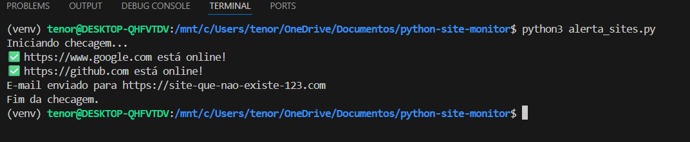
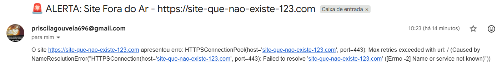

# 🖥️ Python Website Monitor

Projeto em Python para monitoramento de disponibilidade de sites.

O script realiza verificações automáticas em websites configurados e identifica se estão **online ou fora do ar**.
Caso algum site apresente erro de conexão ou não responda corretamente, o sistema envia **um alerta automático por e-mail**.

Este projeto foi desenvolvido como prática de **automação, monitoramento de sistemas e tratamento de erros**, simulando situações reais enfrentadas por profissionais de **TI, análise de sistemas e segurança da informação**.

---

# 🎯 Objetivo do Projeto

O objetivo deste projeto é demonstrar na prática:

* Monitoramento de disponibilidade de websites
* Detecção de falhas de conexão
* Tratamento de erros de rede
* Automação de envio de alertas por e-mail
* Uso de bibliotecas Python para requisições HTTP
* Estruturação e documentação de projeto para portfólio no GitHub

Esse tipo de monitoramento é comum em ambientes corporativos e em áreas como:

* Infraestrutura de TI
* DevOps
* Monitoramento de sistemas
* Cybersecurity / SOC (Security Operations Center)

---

# ⚙️ Tecnologias Utilizadas

* Python 3
* Biblioteca Requests
* SMTP (envio de e-mails)
* Automação de scripts
* Ambiente virtual Python (venv)

---

# 📁 Estrutura do Projeto

```
python-site-monitor
│
├── alerta_sites.py
├── README.md
├── .gitignore
│
├── images
│   ├── script-success.png
│   ├── email-success.png
│   ├── script-error.png
│   └── email-alert-error.png
│
└── venv
```

Descrição:

* **alerta_sites.py** → script principal de monitoramento
* **images/** → pasta com imagens de demonstração do projeto
* **README.md** → documentação do projeto
* **.gitignore** → arquivos que não devem ser enviados para o GitHub
* **venv/** → ambiente virtual Python

---

# 🧪 Como Executar o Projeto

## 1️⃣ Criar ambiente virtual

```
python3 -m venv venv
```

---

## 2️⃣ Ativar o ambiente virtual

Linux / WSL:

```
source venv/bin/activate
```

Windows:

```
venv\Scripts\activate
```

---

## 3️⃣ Instalar dependências

```
pip install requests
```

---

## 4️⃣ Executar o script

```
python3 alerta_sites.py
```

O script iniciará a verificação dos sites configurados.

---

# 🚀 Funcionamento do Sistema

O script realiza os seguintes passos:

1. Carrega a lista de sites configurados
2. Envia uma requisição HTTP para cada site
3. Verifica se o site respondeu corretamente
4. Caso ocorra erro de conexão ou status inválido
5. Um alerta automático é enviado por e-mail

Esse processo simula um sistema simples de **monitoramento de disponibilidade de sites**.

---

# 🖥️ Demonstração do Script

## Execução do Script com Sites Online

Quando os sites estão funcionando normalmente, o terminal mostra:


Exemplo de saída:

```
Iniciando checagem...

✅ https://www.google.com está online!
✅ https://github.com está online!

Fim da checagem.
```

---

# 📧 Envio de Alerta por Email

Quando um site apresenta erro ou não pode ser encontrado, o sistema envia automaticamente um alerta por e-mail.

Exemplo de alerta recebido:


Assunto do e-mail:

```
🚨 ALERTA: Site Fora do Ar
```

Mensagem:

```
O site apresentou erro de conexão.
```

---

# ⚠️ Simulação de Erro de Site

Para demonstrar o funcionamento do monitoramento, foi incluído um site inexistente no script.

Quando o script detecta erro, ele registra a falha:



---

# 📩 Alerta de Erro Recebido

O sistema envia um e-mail contendo o erro detectado.



Exemplo de erro identificado:

```
NameResolutionError
Max retries exceeded
Failed to resolve host
```

Esses erros podem ocorrer quando:

* o site não existe
* o domínio não pode ser resolvido
* há falha de rede
* o servidor está fora do ar

---

# 🔐 Como Gerar a Senha de Aplicativo do Gmail (16 dígitos)

Para que o Python consiga enviar e-mails usando o Gmail, é necessário criar uma **senha de aplicativo**, que é diferente da senha da conta.

Essa senha possui **16 dígitos** e é usada apenas para aplicações externas.

### Passo 1 — Ativar verificação em duas etapas

Acesse a segurança da conta Google:

https://myaccount.google.com/security

Ative a opção:

**Verificação em duas etapas**

Esse passo é obrigatório para poder gerar a senha de aplicativo.

---

### Passo 2 — Gerar senha de aplicativo

Acesse:

https://myaccount.google.com/apppasswords

Escolha:

Aplicativo → **Mail**
Dispositivo → **Outro**

Digite um nome, por exemplo:

```
python-monitor
```

Clique em **Gerar**.

O Google irá mostrar uma senha como esta:

```
abcd efgh ijkl mnop
```

---

### Passo 3 — Usar a senha no código

No código Python, utilize a senha **sem os espaços**:

```
SENHA_APP = "abcdefghijklmnop"
```

Exemplo no código:

```
MEU_EMAIL = "seu_email@gmail.com"
SENHA_APP = "senha_de_16_digitos"
```

⚠️ Importante:

Nunca publique sua senha real no GitHub.

---

# 🔒 Segurança

Por motivos de segurança, a senha utilizada para envio de e-mails **não deve ser publicada no repositório**.

Antes de subir o projeto para o GitHub, substitua no código:

```
SENHA_APP = "sua_senha_real"
```

por algo como:

```
SENHA_APP = "CONFIGURAR_SENHA"
```

Assim você protege suas credenciais.

---

# 👩‍💻 Autora

**Priscila Ferreira de Gouvêia Tenório**

Formação em Desenvolvimento Back-End
Pós-graduação em Cybersecurity e Cybercrime

Projeto desenvolvido como prática de automação, monitoramento de sistemas e construção de portfólio em tecnologia.

